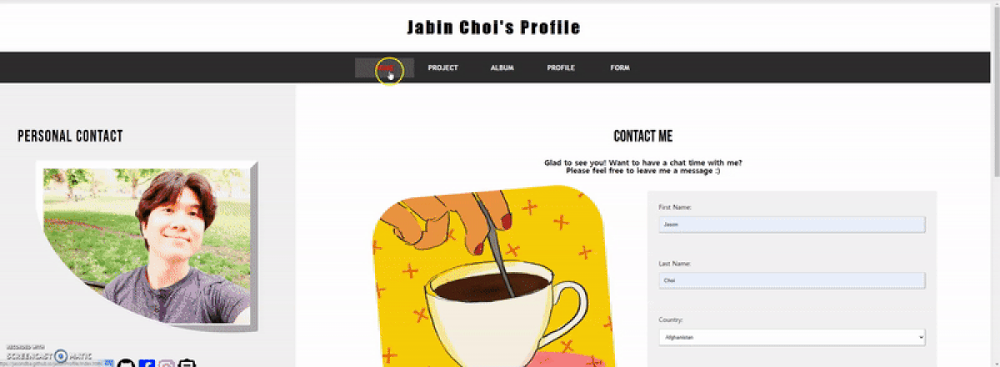

# Welcome to Jason's Website!

> Intro
This is Jason's profile website created by HTML, CSS, and JavaScript.  
**NOTE: This version is only for desktop. (Unfortunately, the grid formate is not for phone, tablet or any devices other than desktop).**

> Contents
- **HOME (index.html):** Main homepage. Including such brief information as 'About Jason Choi', 'Work Experience', and 'Education/Certification'.
- **PROJECT (project.html):** Summary of assignments and individual/team projects completed in school. Each is connected to its GitHub repository.
- **ALBUM (album.html):** Personal pictures having an album format.
- **PROFILE (profile.html):** Summary of Jason Choi with detail of his background (including skill sets and interests).
- **FORM (form.html):** 'Contact Me' area. Including social media icons and a contact form that allows visitors to send a message to me!
